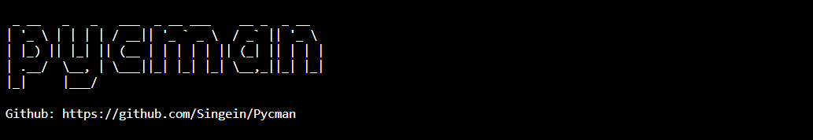
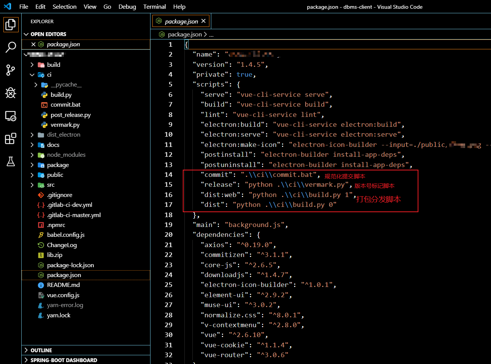
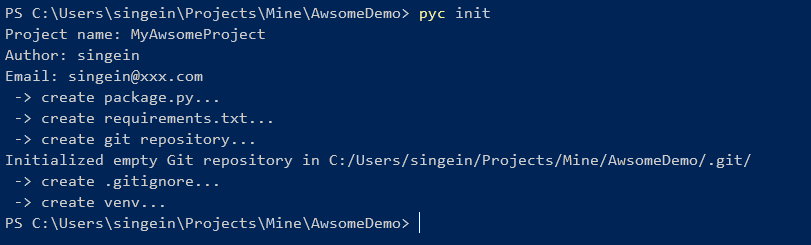
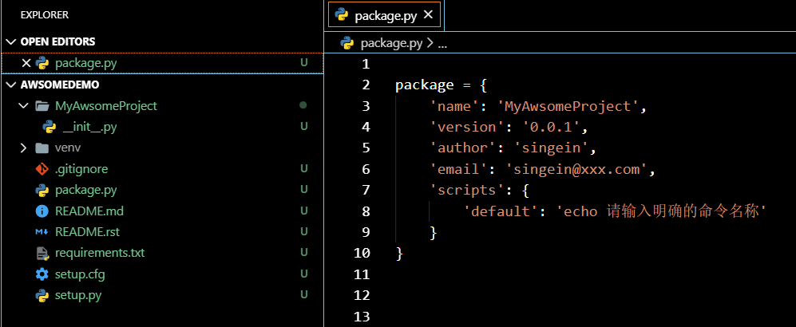
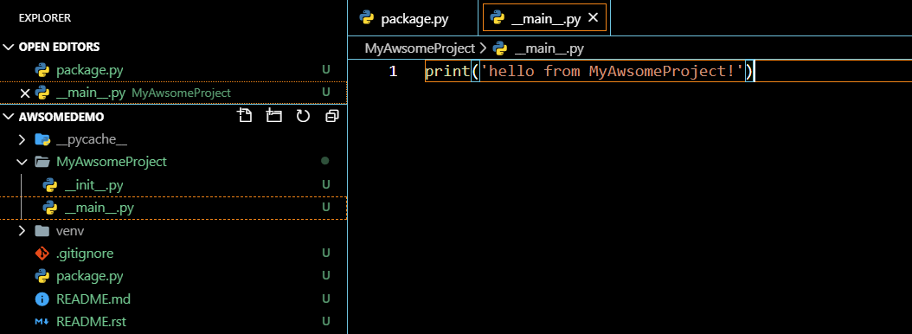
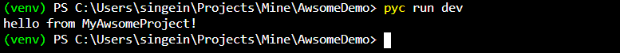
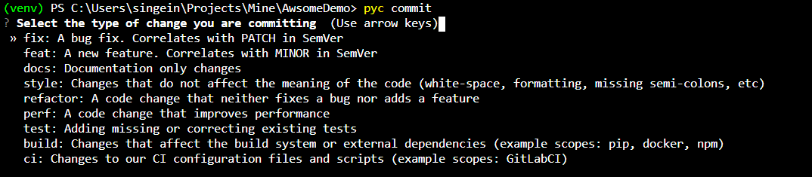
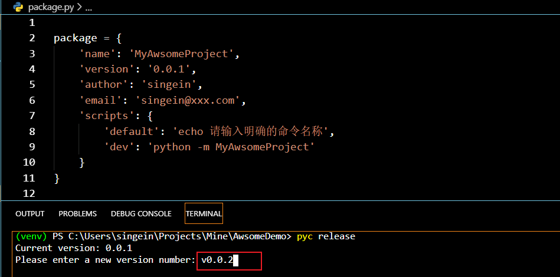
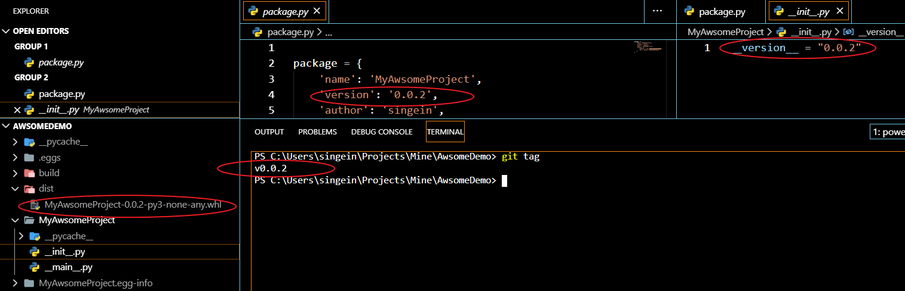
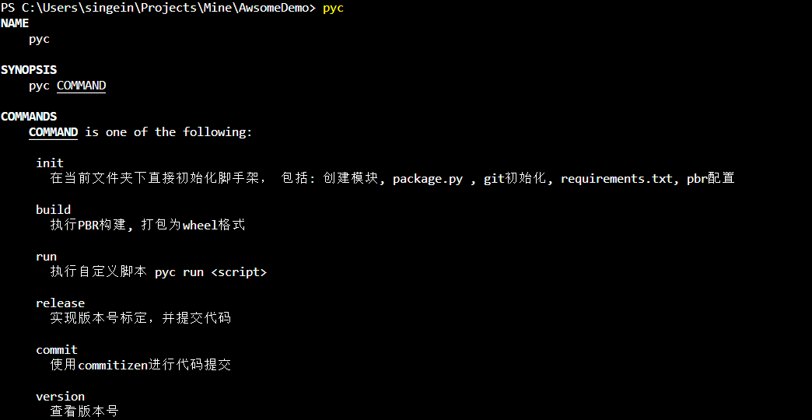

# Pycman

一款用于创建或者管理 python 项目的命令行脚手架工具。



## 为什么开发这个工具

其实是在开发工作当中遇到了几个痛点：

- 每回新建Python模块或者是项目，总是要手写`setup.py` 等相关的配置，虽然复制粘贴，但也要翻文件夹找到个副本不是。
- 再比如需要手动创建的git仓库，虽然只要一条命令
- 再比如创建虚拟环境， 虽然只要一条命令
- 但上面加起来就已经两条了
- 最主要的痛点： `git commit`记录提交怎么协同团队统一规范？
- `commit`记录规范了，如何把这些提交记录和版本号关联在一起，自动在release 的时候生成一套完整的改动日志呢？PBR打包可以通过git tags来自动生成， 这些命令虽然也只有一两条，但参数不怎么记得住呀。

在没开发此工具之前， 我每回都要在项目下新建个处理项目杂物的脚本目录， 里面放着标定版本号的逻辑的脚本，放着提交改动记录的脚本， 放着打包相关的脚本， 这些脚本五花八门， 有可能是batch批处理命令，
有可能是shell脚本，有可能是python脚本，也有可能是别的命令行工具相关的命令。

然后为了实现什么辅助功能就要想着去调用哪个脚本， 想想就很头皮发麻，这对于开发过node的同志们来说， 这就很想念`npm`了， 在`package.json`中定义好`scripts`
属性，在里面添加命令别名，再对应到具体的指令，这样就不用记忆那些繁杂的脚本以及繁杂的参数选项了，一次配好， 使用别名就好， 就像下面那张图中



所以大致总结起来就三点：

- 把`Python`项目创建过程中诸如 `setup.py setup.cfg readme.md .gitignore` 虚拟环境 等自动生成模板或自动完成创建。而且最好能支持自定义项目创建的流程。
- 对`commit`提交记录进行规范化， 对版本管理，改动日志完全自动化掉，我们只需关心按照规范化的提交工具来完成`commit`提交，并简单标记版本号即可完成对整个项目的基础的版本管理， 打包分发管理。
- 提供统一的辅助脚本的入口，可以自定义辅助脚本别名， 就像 `npm `那样去做。

所以为什么`Python`里不能有这么一个工具呢？—— 这就是我打算做 `Pycman`的原因。

## feature

- [ ] 支持扩充自定义模板配置项目初始化流程. 目前还不完善
- [x] 支持定义指令别名，执行自定义指令，使用 pyc run <command>
- [x] 支持 pbr 工程配置模板生成， python 的PBR打包可以根据 git tags 自动生成改动日志
- [x] 使用 `commitizen` 工具进行 commit记录的规范管理。

## Qucik Start

### 安装

```
pip install pycman
```

### 创建项目

请先新建一个空白文件夹，在该文件夹所在目录下，运行如下指令

```shell
pyc init
```

按照提示，补全基本的项目信息



此时，等待创建完毕后，项目目录结构将会如下所示:



其中，MyAwsomeProject 为我们创建的项目，是一个Python包， pycman 已经为你写好了 `__init__.py`, 并在其中标记好了版本号 ， （请不要擅自移除版本号， 否则会影响pycman进行版本号的标注）。

项目目录下同时会自动定义一个package.py 这是一个python模块， 其中定义了一些基本的项目数据， 在scripts下， 我们可以以python字典的数据格式，自己自定义指令。

### 自定义指令配置

在上图中，我们可以看到项目根目录下的package.py模块， 其中存在一条默认指定，别名为 `default`

```python
package = {
    'name': 'MyAwsomeProject',
    'version': '0.0.1',
    'author': 'singein',
    'email': 'singein@xxx.com',
    'scripts': {
        'default': 'echo 请输入明确的命令名称'
    }
}

```

### 执行默认指令

在整个项目的根目录下， 即 `package.py`所在得目录下尝试执行 `pyc run default`：


可以看到，pyc run 后不跟具体的指令名称，将默认执行值为 `default`的指令别名。

### 添加一条自定义指令

我们可以在MyAwsomeProject中添加 `__main__.py`, 以允许我们的python包可以独立运行



接下来我们可以在package.py中定义`dev`指令：

```python
package = {
    'name': 'MyAwsomeProject',
    'version': '0.0.1',
    'author': 'singein',
    'email': 'singein@xxx.com',
    'scripts': {
        'default': 'echo 请输入明确的命令名称',
        'dev': 'python -m MyAwsomeProject'
    }
}
```

接下来我们能便可以在整个项目的根目录下， 即 `package.py`所在得目录下， 执行如下指令：

```shell
pyc run dev
```



### 使用commitizen规范化提交

`commitizen`是一个由python开发得git 提交日志规范化管理工具：

<https://github.com/Woile/commitizen>

Pycman 已将其作为依赖集成到了工具中， 你只需在当前项目目录下执行：

```shell
pyc commit
```



即可按照提示进行规范化的日志提交。

### 打包项目

打包项目之前，请将 setup.cfg中的内容补充完善：

```ini
[metadata]
name = MyAwsomeProject
author = singein
author-email = singein@xxx.com
summary = awsome project created by pycman.
license = MIT
description-file =
    README.rst
home-page = http://example.com
requires-python = >= 3.6

[files]
packages =
    MyAwsomeProject


[entry_points]
console_scripts =
    cmd=package.module:function # 这里的内容为命令行工具入口，请按照实际情况自己定义
```

然后只需简单的使用build指令：

```shell
pyc build
```

即可进行pbr打包， 打包完成的wheel包将被存放在 dist文件夹中，改动日志也将自动生成。

### release版本号标记

执行：

```shell
pyc release
```



输入版本号后回车，如果版本号符合正则表达式  `[0-9]+\.[0-9]+\.[0-9]+$`

则 该版本号将自动写入以下两个地方：

- `MyAwsomeProject` 的 `__init__.py`中的 `__version__`变量下
- `package`下的 `version`属性中

同时，pycman会自动将版本号标记到 git tags 中。

同时，pycman将会自动进行一次 pbr 构建.



如图，整个版本号全部统一规整， 并且git被提交的很干净。

同时自动生成了如下的改动日志:

```shell
CHANGES
=======

v0.0.2
------

* [release] 0.0.2

```

### 使用帮助

