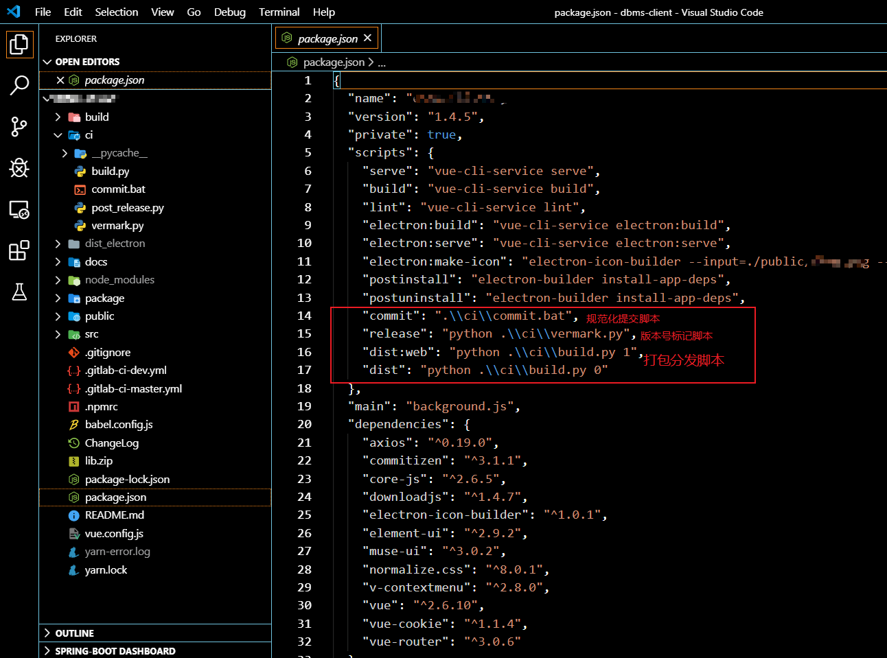

# Pycman

一款用于创建或者管理 python 项目的命令行脚手架工具。


## 为什么开发这个工具

其实是在开发工作当中遇到了几个痛点：

- 每回新建Python模块或者是项目，总是要手写`setup.py` 等相关的配置，虽然复制粘贴，但也要翻文件夹找到个副本不是。
- 再比如需要手动创建的git仓库，虽然只要一条命令
- 再比如创建虚拟环境， 虽然只要一条命令
- 但上面加起来就已经两条了
- 最主要的痛点： `git commit`记录提交怎么协同团队统一规范？
- `commit`记录规范了，如何把这些提交记录和版本号关联在一起，自动在release 的时候生成一套完整的改动日志呢？PBR打包可以通过git tags来自动生成， 这些命令虽然也只有一两条，但参数不怎么记得住呀。

在没开发此工具之前， 我每回都要在项目下新建个处理项目杂物的脚本目录， 里面放着标定版本号的逻辑的脚本，放着提交改动记录的脚本， 放着打包相关的脚本， 这些脚本五花八门， 有可能是batch批处理命令， 有可能是shell脚本，有可能是python脚本，也有可能是别的命令行工具相关的命令。

然后为了实现什么辅助功能就要想着去调用哪个脚本， 想想就很头皮发麻，这对于开发过node的同志们来说， 这就很想念`npm`了， 在`package.json`中定义好`scripts`属性，在里面添加命令别名，再对应到具体的指令，这样就不用记忆那些繁杂的脚本以及繁杂的参数选项了，一次配好， 使用别名就好， 就像下面那张图中




所以大致总结起来就三点：

- 把`Python`项目创建过程中诸如 `setup.py setup.cfg readme.md .gitignore` 虚拟环境 等自动生成模板或自动完成创建。而且最好能支持自定义项目创建的流程。
- 对`commit`提交记录进行规范化， 对版本管理，改动日志完全自动化掉，我们只需关心按照规范化的提交工具来完成`commit`提交，并简单标记版本号即可完成对整个项目的基础的版本管理， 打包分发管理。
- 提供统一的辅助脚本的入口，可以自定义辅助脚本别名， 就像 `npm `那样去做。

 所以为什么`Python`里不能有这么一个工具呢？—— 这就是我打算做 `Pycman`的原因。


## feature

- [ ] 支持扩充自定义模板配置项目初始化流程. 目前还不完善
- [x] 支持定义指令别名，执行自定义指令，使用 pyc run <command>
- [x] 支持 pbr 工程配置模板生成， python 的PBR打包可以根据 git  tags 自动生成改动日志
- [x] 使用 `commitizen` 工具进行 commit记录的规范管理。


## Qucik Start

### 创建项目

创建一个基本的项目


```shell
pyc create 
Project name: myAwsomeProject
...
...
```

### 自定义指令配置

```python
package_info = {
    'name': 'Pycman',
    'author': 'singein',
    'email': 'singein@outlook.com'
}

scripts = {
    # 借鉴 npm 可以自定义指令
    # 在package.py根目录下使用 pyc run <command> 即可执行
    'commit': 'git add . && cz commit',
    'build': 'python setup.py bdist_wheel',
    'default': 'echo 请输入明确的命令名称'
}

```
